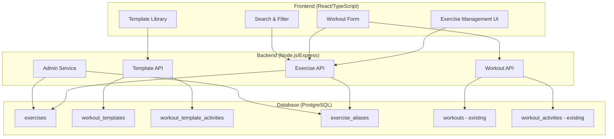

# Design Document: Exercise Database System

## Overview

Das Exercise Database System transformiert die bestehende Sportify-Anwendung von einem hartcodierten Übungssystem zu einer flexiblen, nutzergesteuerten Übungsdatenbank mit Workout-Vorlagen. Das System erweitert die bestehende React/TypeScript Frontend- und Node.js/PostgreSQL Backend-Architektur um neue Datenmodelle, APIs und Benutzeroberflächen.

### Key Design Principles

- **Backward Compatibility**: Bestehende Trainingsdaten bleiben vollständig erhalten
- **Extensibility**: Neue Übungstypen können einfach hinzugefügt werden
- **User Experience**: Intuitive Bedienung mit intelligenter Suche und Filterung
- **Data Integrity**: Robuste Deduplizierung und Validierung
- **Performance**: Effiziente Suche und Caching für große Übungsdatenbanken
- **Standalone Exercises**: Alle Übungen sind eigenständige Entitäten ohne Child/Parent-Beziehungen. Varianten wie "Incline Push-ups", "Decline Push-ups" oder "Weighted Pull-ups" werden als separate, vollständige Übungen erstellt

## Architecture

### System Components



### Technology Stack Integration

- **Frontend**: React 18, TypeScript, Tailwind CSS, Radix UI (bestehend)
- **Backend**: Node.js, Express, PostgreSQL (bestehend)
- **New Dependencies**:
  - `fuse.js` für fuzzy search
  - `slugify` für URL-sichere Übungsnamen
  - `string-similarity` für Deduplizierung

## Components and Interfaces

### Database Schema

#### New Tables

```sql
-- Exercises table (erweitert bestehende)
CREATE TABLE exercises (
    id VARCHAR(50) PRIMARY KEY,
    name TEXT NOT NULL,
    description TEXT,
    category VARCHAR(50) NOT NULL, -- 'strength', 'cardio', 'calisthenics', 'climbing'
    muscle_groups TEXT[], -- ['chest', 'shoulders', 'triceps']
    equipment TEXT[], -- ['barbell', 'bodyweight', 'dumbbell']
    difficulty_factor DECIMAL(4,2) NOT NULL DEFAULT 1.0, -- For scoring
    unit_type VARCHAR(20) NOT NULL, -- 'reps', 'distance', 'time', 'routes'
    requires_weight BOOLEAN DEFAULT false,
    supports_weight BOOLEAN DEFAULT false,
    supports_sets BOOLEAN DEFAULT true,
    unit_options JSONB NOT NULL DEFAULT '[]'::jsonb,
    created_by UUID REFERENCES users(id) ON DELETE SET NULL,
    created_at TIMESTAMPTZ NOT NULL DEFAULT NOW(),
    updated_at TIMESTAMPTZ NOT NULL DEFAULT NOW(),
    is_active BOOLEAN DEFAULT true,
    is_approved BOOLEAN DEFAULT false, -- Admin approval required
    slug VARCHAR(100) UNIQUE NOT NULL -- For deduplication
);

-- Exercise aliases for deduplication
CREATE TABLE exercise_aliases (
    id SERIAL PRIMARY KEY,
    exercise_id VARCHAR(50) REFERENCES exercises(id) ON DELETE CASCADE,
    alias_name TEXT NOT NULL,
    normalized_name TEXT NOT NULL, -- Lowercase, no spaces
    created_at TIMESTAMPTZ DEFAULT NOW()
);

-- Workout templates
CREATE TABLE workout_templates (
    id UUID PRIMARY KEY DEFAULT gen_random_uuid(),
    name TEXT NOT NULL,
    description TEXT,
    category VARCHAR(50), -- 'strength', 'cardio', 'mixed', 'climbing'
    estimated_duration INTEGER, -- minutes
    difficulty_level INTEGER CHECK (difficulty_level BETWEEN 1 AND 5),
    visibility VARCHAR(20) NOT NULL DEFAULT 'private', -- 'private', 'friends', 'public'
    created_by UUID NOT NULL REFERENCES users(id) ON DELETE CASCADE,
    created_at TIMESTAMPTZ NOT NULL DEFAULT NOW(),
    updated_at TIMESTAMPTZ NOT NULL DEFAULT NOW(),
    is_active BOOLEAN DEFAULT true,
    usage_count INTEGER DEFAULT 0 -- Track popularity
);

-- Workout template activities
CREATE TABLE workout_template_activities (
    id UUID PRIMARY KEY DEFAULT gen_random_uuid(),
    template_id UUID NOT NULL REFERENCES workout_templates(id) ON DELETE CASCADE,
    exercise_id VARCHAR(50) NOT NULL REFERENCES exercises(id) ON DELETE CASCADE,
    order_index INTEGER NOT NULL,
    target_sets INTEGER,
    target_reps INTEGER,
    target_weight DECIMAL(6,2),
    target_distance DECIMAL(8,2),
    target_time INTEGER, -- seconds
    rest_time INTEGER, -- seconds between sets
    notes TEXT,
    created_at TIMESTAMPTZ DEFAULT NOW()
);

-- Exercise reports for admin moderation
CREATE TABLE exercise_reports (
    id UUID PRIMARY KEY DEFAULT gen_random_uuid(),
    exercise_id VARCHAR(50) NOT NULL REFERENCES exercises(id) ON DELETE CASCADE,
    reported_by UUID NOT NULL REFERENCES users(id) ON DELETE CASCADE,
    reason VARCHAR(50) NOT NULL, -- 'duplicate', 'incorrect_scoring', 'inappropriate'
    description TEXT,
    status VARCHAR(20) DEFAULT 'pending', -- 'pending', 'resolved', 'dismissed'
    resolved_by UUID REFERENCES users(id) ON DELETE SET NULL,
    resolved_at TIMESTAMPTZ,
    created_at TIMESTAMPTZ DEFAULT NOW()
);
```

#### Indexes for Performance

```sql
CREATE INDEX idx_exercises_category ON exercises(category);
CREATE INDEX idx_exercises_slug ON exercises(slug);
CREATE INDEX idx_exercises_active_approved ON exercises(is_active, is_approved);
CREATE INDEX idx_exercise_aliases_normalized ON exercise_aliases(normalized_name);
CREATE INDEX idx_workout_templates_visibility ON workout_templates(visibility, is_active);
CREATE INDEX idx_workout_templates_created_by ON workout_templates(created_by);
CREATE INDEX idx_workout_template_activities_template ON workout_template_activities(template_id, order_index);
```

#### Exercise Variant Strategy

**Standalone Exercise Approach**: Das System behandelt alle Übungen als eigenständige, vollständige Entitäten ohne hierarchische Beziehungen. Dies bedeutet:

- **Separate Übungen für Varianten**: "Push-ups", "Incline Push-ups", "Decline Push-ups" und "Weighted Push-ups" sind vier separate Übungen in der Datenbank
- **Keine Parent-Child-Beziehungen**: Es gibt keine `parent_exercise_id` oder ähnliche Felder in der exercises Tabelle
- **Vollständige Metadaten**: Jede Übungsvariante hat ihre eigenen vollständigen Metadaten (category, muscle_groups, difficulty_factor, etc.)
- **Einfache Filterung**: Benutzer können nach spezifischen Varianten suchen und filtern
- **Klare Statistiken**: Jede Variante wird separat in Statistiken und Fortschrittsverfolgung behandelt

**Vorteile dieses Ansatzes**:

- Einfachere Datenstruktur und weniger komplexe Abfragen
- Klarere Benutzeroberfläche ohne verschachtelte Hierarchien
- Bessere Performance bei Suche und Filterung
- Einfachere Implementierung von Scoring und Statistiken
- Flexibilität bei der Definition von Übungseigenschaften pro Variante

**Deduplizierung**: Das Alias-System verhindert trotzdem Duplikate, indem ähnliche Namen erkannt und zusammengeführt werden können.

### API Endpoints

#### Exercise Management API

```typescript
// GET /api/exercises - Search and filter exercises
interface ExerciseSearchParams {
  search?: string;
  category?: string;
  muscle_groups?: string[];
  equipment?: string[];
  unit_type?: string;
  requires_weight?: boolean;
  limit?: number;
  offset?: number;
}

// POST /api/exercises - Create new exercise
interface CreateExerciseRequest {
  name: string;
  description?: string;
  category: string;
  muscle_groups: string[];
  equipment: string[];
  difficulty_factor: number;
  unit_type: string;
  requires_weight: boolean;
  supports_weight: boolean;
  supports_sets: boolean;
  unit_options: UnitOption[];
}

// GET /api/exercises/suggestions?name=pull - Get similar exercises for deduplication
interface ExerciseSuggestion {
  id: string;
  name: string;
  similarity: number;
  aliases: string[];
}

// POST /api/exercises/:id/report - Report exercise issues
interface ExerciseReportRequest {
  reason: "duplicate" | "incorrect_scoring" | "inappropriate";
  description?: string;
  suggested_merge_with?: string; // For duplicate reports
}
```

#### Workout Template API

```typescript
// GET /api/workout-templates - Get templates with filtering
interface TemplateSearchParams {
  search?: string;
  category?: string;
  visibility?: "private" | "friends" | "public";
  created_by?: string;
  difficulty_level?: number;
  max_duration?: number;
}

// POST /api/workout-templates - Create template
interface CreateTemplateRequest {
  name: string;
  description?: string;
  category?: string;
  estimated_duration?: number;
  difficulty_level?: number;
  visibility: "private" | "friends" | "public";
  activities: TemplateActivity[];
}

interface TemplateActivity {
  exercise_id: string;
  order_index: number;
  target_sets?: number;
  target_reps?: number;
  target_weight?: number;
  target_distance?: number;
  target_time?: number;
  rest_time?: number;
  notes?: string;
}

// POST /api/workout-templates/:id/use - Create workout from template
interface UseTemplateRequest {
  workout_date: string;
  start_time: string;
  title?: string; // Override template name
}
```

#### Admin API

```typescript
// GET /api/admin/exercises/pending - Get exercises awaiting approval
// PUT /api/admin/exercises/:id/approve - Approve exercise
// PUT /api/admin/exercises/:id/merge - Merge duplicate exercises
interface MergeExercisesRequest {
  target_exercise_id: string;
  source_exercise_ids: string[];
  keep_aliases: boolean;
}

// GET /api/admin/exercise-reports - Get reported exercises
// PUT /api/admin/exercise-reports/:id/resolve - Resolve report
```

### Frontend Components

#### Exercise Management Components

```typescript
// ExerciseDatabase.tsx - Main exercise management page
interface ExerciseDatabaseProps {
  onExerciseSelect?: (exercise: Exercise) => void;
  selectionMode?: boolean;
}

// ExerciseForm.tsx - Create/edit exercise form
interface ExerciseFormProps {
  exercise?: Exercise;
  onSave: (exercise: Exercise) => void;
  onCancel: () => void;
}

// ExerciseSearch.tsx - Search and filter component
interface ExerciseSearchProps {
  onResults: (exercises: Exercise[]) => void;
  filters: ExerciseFilters;
  onFiltersChange: (filters: ExerciseFilters) => void;
}

// ExerciseCard.tsx - Display exercise information
interface ExerciseCardProps {
  exercise: Exercise;
  onSelect?: () => void;
  onEdit?: () => void;
  onReport?: () => void;
  showActions?: boolean;
}
```

#### Workout Template Components

```typescript
// WorkoutTemplateLibrary.tsx - Browse and manage templates
interface WorkoutTemplateLibraryProps {
  visibility?: "all" | "private" | "friends" | "public";
  onTemplateSelect?: (template: WorkoutTemplate) => void;
}

// WorkoutTemplateForm.tsx - Create/edit template
interface WorkoutTemplateFormProps {
  template?: WorkoutTemplate;
  onSave: (template: WorkoutTemplate) => void;
  onCancel: () => void;
}

// TemplateActivityBuilder.tsx - Build template activities
interface TemplateActivityBuilderProps {
  activities: TemplateActivity[];
  onActivitiesChange: (activities: TemplateActivity[]) => void;
  availableExercises: Exercise[];
}
```

#### Enhanced Workout Form

```typescript
// Enhanced WorkoutForm.tsx with exercise database integration
interface EnhancedWorkoutFormProps extends WorkoutFormProps {
  template?: WorkoutTemplate; // Pre-fill from template
  exerciseDatabase: Exercise[];
}

// ExerciseSelector.tsx - Dropdown with search for workout form
interface ExerciseSelectorProps {
  value: string;
  onChange: (exerciseId: string) => void;
  exercises: Exercise[];
  placeholder?: string;
  filter?: ExerciseFilters;
}
```

## Data Models

### Core Data Types

```typescript
interface Exercise {
  id: string;
  name: string;
  description?: string;
  category: ExerciseCategory;
  muscle_groups: string[];
  equipment: string[];
  difficulty_factor: number;
  unit_type: UnitType;
  requires_weight: boolean;
  supports_weight: boolean;
  supports_sets: boolean;
  unit_options: UnitOption[];
  created_by?: string;
  created_at: string;
  updated_at: string;
  is_active: boolean;
  is_approved: boolean;
  slug: string;
  aliases?: string[];
}

type ExerciseCategory =
  | "strength"
  | "cardio"
  | "calisthenics"
  | "climbing"
  | "flexibility"
  | "sports";
type UnitType = "reps" | "distance" | "time" | "routes" | "weight";

interface UnitOption {
  value: string;
  label: string;
  multiplier: number; // For unit conversion
  is_default?: boolean;
}

interface WorkoutTemplate {
  id: string;
  name: string;
  description?: string;
  category?: string;
  estimated_duration?: number;
  difficulty_level?: number;
  visibility: "private" | "friends" | "public";
  created_by: string;
  created_at: string;
  updated_at: string;
  is_active: boolean;
  usage_count: number;
  activities: TemplateActivity[];
}

interface TemplateActivity {
  id: string;
  exercise_id: string;
  exercise?: Exercise; // Populated in API responses
  order_index: number;
  target_sets?: number;
  target_reps?: number;
  target_weight?: number;
  target_distance?: number;
  target_time?: number;
  rest_time?: number;
  notes?: string;
}

interface ExerciseFilters {
  search?: string;
  category?: ExerciseCategory;
  muscle_groups?: string[];
  equipment?: string[];
  unit_type?: UnitType;
  requires_weight?: boolean;
  difficulty_range?: [number, number];
}
```

### Scoring System Data

```typescript
interface ScoringConfig {
  base_formula: string; // "difficulty_factor * amount"
  category_multipliers: Record<ExerciseCategory, number>;
  unit_conversions: Record<string, number>;
  bodyweight_factor?: number; // For future implementation
}

interface ExerciseScore {
  exercise_id: string;
  amount: number;
  unit: string;
  weight?: number;
  calculated_points: number;
  formula_used: string;
}
```

## Correctness Properties

_A property is a characteristic or behavior that should hold true across all valid executions of a system-essentially, a formal statement about what the system should do. Properties serve as the bridge between human-readable specifications and machine-verifiable correctness guarantees._

### Property Reflection

After analyzing all acceptance criteria, I identified several areas where properties can be consolidated to avoid redundancy:

- **Exercise Creation Properties**: Properties 1.1, 1.3, and 2.1-2.4 can be combined into comprehensive exercise creation validation
- **Search and Filter Properties**: Properties 1.5, 8.1, 8.2, and 8.5 overlap significantly and can be unified
- **Template Management Properties**: Properties 4.1, 4.4, and 4.5 cover similar template functionality
- **Admin Operations Properties**: Properties 3.1, 3.2, and 3.5 can be consolidated into admin functionality validation
- **Migration Properties**: Properties 7.1, 7.2, and 7.5 are all part of the same migration process

### Core Properties

**Property 1: Exercise Data Persistence and Validation**
_For any_ valid exercise data with all required properties, creating and then retrieving the exercise should return an equivalent exercise object with all properties preserved
**Validates: Requirements 1.1, 2.1, 2.2, 2.3, 2.4**

**Property 2: Exercise Slug Generation Consistency**
_For any_ exercise name, generating a slug multiple times should always produce the same normalized result, and similar names should produce similar slugs for deduplication detection
**Validates: Requirements 1.2, 1.3**

**Property 3: Exercise Search and Filter Accuracy**
_For any_ search query and filter combination, all returned exercises should match the specified criteria, and no matching exercises should be excluded from results
**Validates: Requirements 1.5, 8.1, 8.2, 8.5**

**Property 4: Exercise Type Validation**
_For any_ exercise type (strength, cardio, calisthenics, climbing), the system should enforce the correct validation rules and support the appropriate units and properties for that type
**Validates: Requirements 1.4, 2.5, 2.6**

**Property 5: Workout Template Round-Trip Consistency**
_For any_ workout template with activities, creating the template and then using it to generate a workout should preserve all exercise references, sets, reps, and parameters
**Validates: Requirements 4.1, 4.5**

**Property 6: Template Visibility Access Control**
_For any_ workout template with a specific visibility level, only users with appropriate permissions should be able to access and use the template
**Validates: Requirements 4.2, 4.3**

**Property 7: Exercise Reference Integrity During Merging**
_For any_ exercise merge operation, all existing references in workouts, templates, and other data should be updated to point to the target exercise, with no orphaned references remaining
**Validates: Requirements 3.3, 7.2**

**Property 8: Scoring System Consistency**
_For any_ exercise with defined difficulty factors and scoring rules, calculating points for the same input values should always produce the same result using the appropriate formula for that exercise type
**Validates: Requirements 6.1, 6.2, 6.3**

**Property 9: Migration Data Preservation**
_For any_ existing workout data before migration, after migration all workouts should maintain the same point calculations and exercise references, with no data loss
**Validates: Requirements 7.1, 7.3, 7.4**

**Property 10: Admin Operations Completeness**
_For any_ admin operation (approve, merge, delete exercises), the operation should complete successfully and all related data (aliases, reports, references) should be updated consistently
**Validates: Requirements 3.1, 3.2, 3.4, 3.5**

**Property 11: Dynamic Form Field Generation**
_For any_ exercise type selection in workout forms, the displayed input fields should match exactly the requirements and capabilities of that exercise type
**Validates: Requirements 5.3, 5.5**

**Property 12: Climbing Exercise Specificity**
_For any_ climbing exercise (boulder, sport, trad), the system should support the appropriate grading systems, attempt tracking, and scoring calculations specific to that climbing type
**Validates: Requirements 9.1, 9.2, 9.4, 9.5**

<function_calls>
<invoke name="prework">
<parameter name="featureName">exercise-database-system

## Error Handling

### Exercise Management Errors

- **Duplicate Exercise Detection**: When creating exercises, show similar existing exercises with similarity scores
- **Validation Errors**: Clear field-level validation for required properties, unit compatibility, and scoring factors
- **Permission Errors**: Appropriate error messages for unauthorized access to admin functions or private templates
- **Database Constraint Violations**: Handle unique constraint violations gracefully with user-friendly messages

### Template and Workout Errors

- **Template Not Found**: Handle cases where templates are deleted or made private after being shared
- **Exercise Reference Errors**: Handle cases where exercises in templates are deleted or merged
- **Conversion Errors**: Validate unit conversions and handle invalid measurements gracefully
- **Concurrency Errors**: Handle simultaneous edits to templates and exercises with optimistic locking

### Migration and Data Integrity Errors

- **Migration Rollback**: Provide rollback mechanisms for failed migrations with data restoration
- **Reference Integrity**: Detect and repair broken exercise references during system maintenance
- **Scoring Inconsistencies**: Alert administrators to exercises with unusual scoring patterns
- **Performance Degradation**: Monitor and alert on slow search performance with large exercise databases

## Testing Strategy

### Dual Testing Approach

The system will use both unit tests and property-based tests to ensure comprehensive coverage:

**Unit Tests** focus on:

- Specific API endpoint behavior and error cases
- UI component rendering and user interactions
- Database migration scripts and data transformations
- Integration between frontend and backend components

**Property-Based Tests** focus on:

- Universal properties that hold across all valid inputs
- Data consistency and integrity across operations
- Search and filter accuracy with randomized datasets
- Scoring system consistency with varied exercise types

### Property-Based Testing Configuration

- **Testing Framework**: Use `fast-check` for TypeScript property-based testing
- **Test Iterations**: Minimum 100 iterations per property test
- **Test Data Generation**: Smart generators that create realistic exercise data, workout templates, and user scenarios
- **Property Test Tags**: Each test references its design document property using the format:
  - **Feature: exercise-database-system, Property 1: Exercise Data Persistence and Validation**

### Test Categories

#### Exercise Database Tests

- **Property Tests**: Exercise creation, search accuracy, deduplication detection
- **Unit Tests**: API endpoints, validation rules, admin operations
- **Integration Tests**: Frontend-backend exercise management workflows

#### Workout Template Tests

- **Property Tests**: Template creation, visibility controls, workout generation
- **Unit Tests**: Template CRUD operations, permission checks
- **Integration Tests**: Template library UI, template-to-workout conversion

#### Migration and Compatibility Tests

- **Property Tests**: Data preservation during migration, reference integrity
- **Unit Tests**: Migration scripts, API backward compatibility
- **Integration Tests**: End-to-end migration testing with real data

#### Performance and Scalability Tests

- **Load Tests**: Search performance with large exercise databases
- **Stress Tests**: Concurrent template usage and exercise creation
- **Memory Tests**: Efficient handling of large workout template libraries

### Test Data Management

- **Seed Data**: Comprehensive set of exercises covering all categories and edge cases
- **User Scenarios**: Realistic user profiles with different preferences and usage patterns
- **Template Variations**: Diverse workout templates with various complexity levels
- **Migration Test Data**: Representative existing workout data for migration testing

## Implementation Phases

### Phase 1: Core Exercise Database (Weeks 1-3)

- Database schema creation and migration
- Basic exercise CRUD API endpoints
- Exercise creation and management UI
- Simple search and filtering functionality
- Admin approval workflow

### Phase 2: Enhanced Search and Deduplication (Weeks 4-5)

- Advanced search with fuzzy matching
- Deduplication detection and suggestions
- Exercise reporting and moderation system
- Alias management for alternative names

### Phase 3: Workout Template System (Weeks 6-8)

- Workout template data model and API
- Template creation and management UI
- Template library with visibility controls
- Template-to-workout conversion functionality

### Phase 4: Workout Form Integration (Weeks 9-10)

- Enhanced workout form with exercise database integration
- Exercise selector with search and autocomplete
- Dynamic form fields based on exercise type
- Migration of existing workout data

### Phase 5: Scoring System and Migration (Weeks 11-12)

- Scoring system implementation with configurable factors
- Data migration from hardcoded exercises
- Backward compatibility testing
- Performance optimization and caching

### Phase 6: Climbing and Specialized Features (Weeks 13-14)

- Boulder and climbing exercise support
- Specialized grading systems (V-Scale, Font-Scale)
- Hangboard training features
- Advanced scoring for climbing activities

## Success Metrics

### Functional Metrics

- **Exercise Database Growth**: Target 500+ exercises within 3 months
- **Template Usage**: 70% of active users create or use workout templates
- **Search Effectiveness**: <2 seconds average search response time
- **Deduplication Success**: <5% duplicate exercises in database

### User Experience Metrics

- **Workout Creation Time**: 30% reduction in time to create workouts
- **Exercise Discovery**: 80% of users find exercises through search vs. manual entry
- **Template Adoption**: 50% of workouts created from templates within 6 months
- **Admin Efficiency**: 90% of exercise approvals completed within 24 hours

### Technical Metrics

- **API Performance**: <200ms response time for exercise search
- **Database Efficiency**: <1MB memory usage per 1000 exercises
- **Migration Success**: 100% data preservation during migration
- **System Reliability**: 99.9% uptime for exercise database features

### Quality Metrics

- **Test Coverage**: >90% code coverage for exercise and template features
- **Property Test Success**: All 12 correctness properties pass consistently
- **User Satisfaction**: >4.5/5 rating for new exercise management features
- **Bug Rate**: <1 critical bug per 1000 exercise operations

## Migration Strategy

### Data Migration Plan

#### Phase 1: Schema Preparation

1. Create new exercise database tables
2. Populate with existing hardcoded exercises
3. Create mapping table for backward compatibility
4. Test data integrity and constraints

#### Phase 2: Reference Migration

1. Update existing workout_activities to reference exercise IDs
2. Preserve all existing point calculations
3. Create exercise aliases for alternative names
4. Validate all references are correctly mapped

#### Phase 3: API Migration

1. Update backend APIs to use exercise database
2. Maintain backward compatibility for existing endpoints
3. Add new exercise management endpoints
4. Test all existing functionality works unchanged

#### Phase 4: Frontend Migration

1. Update workout form to use exercise database
2. Replace hardcoded exercise lists with dynamic loading
3. Add exercise search and selection components
4. Ensure existing workflows continue to work

#### Phase 5: Cleanup and Optimization

1. Remove hardcoded exercise references from codebase
2. Optimize database queries and add appropriate indexes
3. Implement caching for frequently accessed exercises
4. Monitor performance and adjust as needed

### Rollback Strategy

- **Database Snapshots**: Full database backup before each migration phase
- **Feature Flags**: Ability to switch between old and new exercise systems
- **Gradual Rollout**: Deploy to subset of users first, monitor for issues
- **Automated Testing**: Comprehensive test suite runs before each deployment
- **Monitoring**: Real-time monitoring of key metrics during migration

## Risk Mitigation

### Technical Risks

- **Performance Degradation**: Implement caching and database optimization
- **Data Loss**: Comprehensive backup and testing strategy
- **Integration Issues**: Extensive integration testing and gradual rollout
- **Scalability Concerns**: Load testing and performance monitoring

### User Experience Risks

- **Learning Curve**: Provide guided tutorials and help documentation
- **Feature Disruption**: Maintain existing workflows during transition
- **Data Migration Confusion**: Clear communication about changes
- **Template Complexity**: Start with simple templates, add complexity gradually

### Business Risks

- **Development Timeline**: Phased approach allows for timeline adjustments
- **Resource Requirements**: Clear resource planning and allocation
- **User Adoption**: Gradual rollout with user feedback incorporation
- **Maintenance Overhead**: Automated testing and monitoring reduce manual overhead
