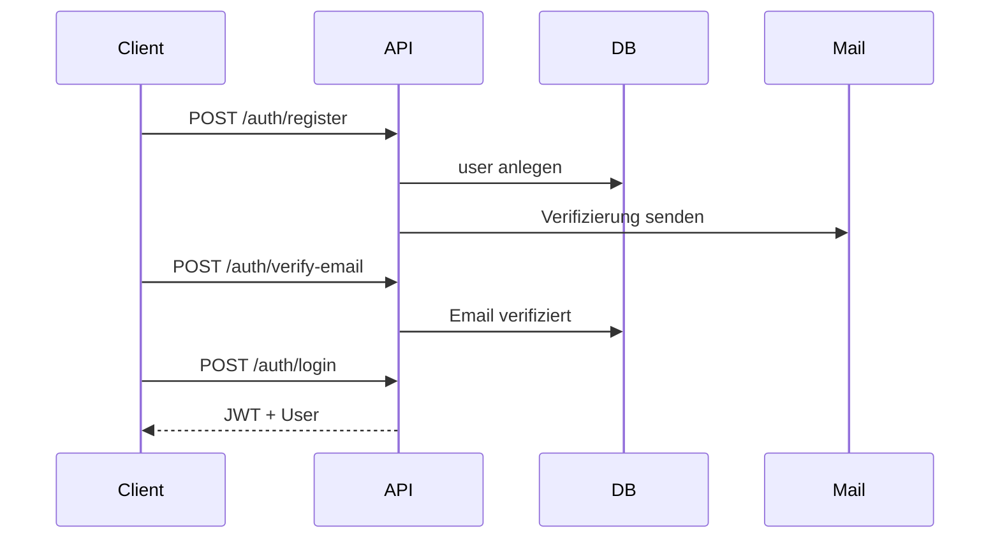
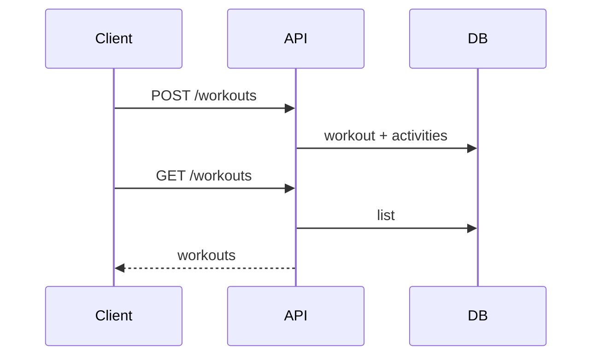

# Architektur

Diese Dokumentation beschreibt die Systemarchitektur von Sportify.

## Überblick

```mermaid
flowchart LR
  subgraph Client
    UI[React App (Vite)]
    PWA[Service Worker / PWA]
  end

  subgraph Server
    API[Express API]
    Jobs[Event Jobs / Cron]
  end

  subgraph Daten
    DB[(PostgreSQL)]
  end

  subgraph Drittanbieter
    Mail[Nodemailer / SMTP]
    Push[Web Push]
  end

  UI -->|REST/JSON| API
  PWA -->|Offline Cache| UI
  API --> DB
  API --> Mail
  API --> Push
  Jobs --> API
  Jobs --> DB
```

## Frontend

- React 18 + Vite
- Routing via React Router
- Datenzugriff via TanStack Query
- UI via Tailwind + shadcn
- i18n via i18next
- PWA/Offline via Service Worker

**Struktur (Auszug):**

```
src/
├── pages/         # Screens
├── components/    # UI-Komponenten
├── features/      # Feature-Module
├── services/      # API-Clients
├── contexts/      # Auth/Theme
├── hooks/         # Custom Hooks
└── utils/         # Helpers
```

## Backend

- Node.js + Express
- PostgreSQL via `pg` Pool
- JWT Auth + 2FA (TOTP)
- E-Mail Queue + Push

**Struktur (Auszug):**

```
server.js
routes/
middleware/
services/
utils/
migrations/
```

## Datenbank

- SQL‑Migrationen in `migrations/`
- Kernobjekte: `users`, `workouts`, `workout_activities`, `exercises`,
  `training_journal_entries`, `friendships`, `friend_requests`,
  `notifications`, `invitations`, `push_subscriptions`, `job_runs`.

## Authentifizierung & Sicherheit

- JWT in `Authorization: Bearer <token>`
- 2FA (TOTP) + Backup‑Codes
- E‑Mail‑Verifizierung
- Rollen: `user`, `admin`

## Datenflüsse (Beispiele)

### Auth‑Flow



### Workout‑Flow



## Deployment

- Frontend: Vite Build (statisch)
- Backend: Express App (`server.js`)
- Zielplattform: Vercel (oder eigener Node‑Host)

Siehe [deployment.md](deployment.md).
