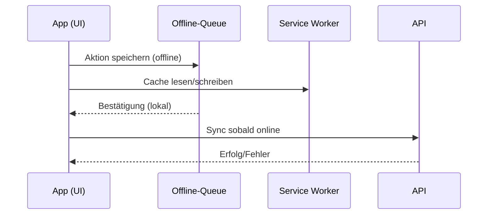
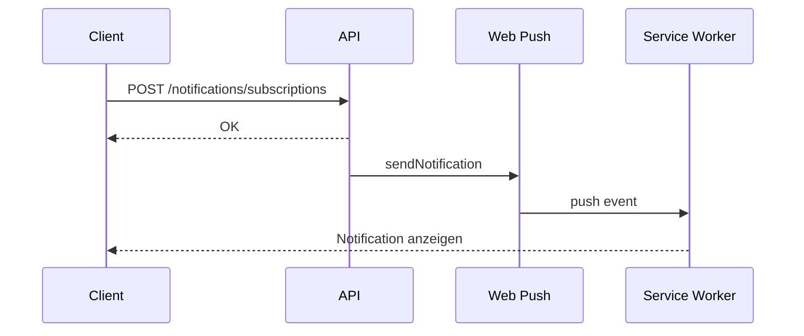

# PWA Dokumentation - Sportify

## Übersicht

Diese Dokumentation beschreibt die implementierten PWA-Features, deren Funktionsweise und Browser-Support.

## Implementierte Features

### 1. Service Worker

**Datei**: `public/sw.js`

Der Service Worker implementiert folgende Strategien:

- **Cache First**: Für statische Assets (JS, CSS, Icons, Bilder)
- **Network First**: Für API-Requests mit Fallback auf Cache
- **Network First mit Offline-Fallback**: Für HTML-Requests (zeigt Offline-Seite bei Fehler)

**Cache-Versionierung**: Der Service Worker verwendet eine Versionsnummer (`CACHE_VERSION`) für Cache-Invalidierung bei Updates.

**Registrierung**: `src/utils/serviceWorker.ts` - Automatische Registrierung beim App-Start.

### 2. Offline-Funktionalität

**Offline-Seite**: `public/offline.html`

- Benutzerfreundliche Offline-Seite mit Theme-Support (Light/Dark Mode)
- Automatische Erkennung wenn Verbindung wiederhergestellt wird

**Offline-Detection**: `src/hooks/useOnlineStatus.ts`

- Custom Hook für Online/Offline-Status
- Event-basiert (nutzt `navigator.onLine` und `online`/`offline` Events)

**Offline-Banner**: `src/components/OfflineBanner.tsx`

- Zeigt Banner oben auf der Seite wenn offline
- Automatisches Verstecken wenn wieder online

**Offline-Synchronisation**: `src/utils/offlineQueue.ts`

- Queue-System für Offline-Aktionen
- Automatische Synchronisation wenn wieder online
- Retry-Mechanismus (max. 3 Versuche)

**Datenfluss (Offline‑Sync):**



### 3. Install Prompt

**Komponente**: `src/components/InstallPrompt.tsx`

Browser-spezifische Anleitungen für:

- iOS (Safari Mobile)
- Android Chrome
- Chrome Desktop
- Firefox (Mobile & Desktop)
- Edge
- Safari Desktop (macOS)

**Funktionsweise**:

- Nutzt `beforeinstallprompt` Event wo verfügbar (Chrome, Edge)
- Zeigt manuelle Anleitung für Safari/iOS
- Speichert Install-Status in localStorage

### 4. Badge API

**Datei**: `src/utils/badge.ts`

Zeigt Notification Count auf dem App-Icon an.

**Browser-Support**:

- ✅ Chrome/Edge: Unterstützt
- ❌ Firefox: Nicht unterstützt
- ❌ Safari (iOS/macOS): Nicht unterstützt

**Integration**: Automatisch in `src/components/Notifications.tsx` integriert.

### 5. Share Target API

**Manifest**: `public/site.webmanifest`

Ermöglicht es, dass Sportify als Ziel für Share-Aktionen von anderen Apps verwendet werden kann.

**Handler**: `src/pages/Share.tsx`

- Empfängt geteilte Inhalte (Titel, Text, URL)
- Zeigt geteilte Daten an

### 6. Performance-Optimierungen

**Preload/Prefetch**: `index.html`

- DNS-Prefetch für externe Ressourcen
- Preload für kritische Assets
- Preconnect für wichtige Domains

**Code Splitting**: Bereits implementiert in `vite.config.ts`

- Vendor Chunks für besseres Caching
- Route-based Code Splitting

### 7. Push-Benachrichtigungen

**Backend**:

- Endpunkte `POST /api/notifications/subscriptions` und `DELETE /api/notifications/subscriptions` speichern bzw. löschen Browser-Subscriptions.
- `GET /api/notifications/public-key` liefert den VAPID Public Key (falls konfiguriert).
- Jede neue Notification (`services/notificationService.createNotification`) stößt einen Push-Versand an. Fehlerhafte oder abgemeldete Endpoints werden automatisch bereinigt.
- Web-Push ist optional (`optionalDependencies`). Falls `web-push` nicht installiert oder keine VAPID-Keys gesetzt sind, werden Pushes übersprungen.

**Frontend**:

- Hook `usePushNotifications` (siehe `src/hooks/usePushNotifications.ts`) übernimmt Permission-Handling, Subscription-Registrierung und Sync.
- `src/components/Notifications.tsx` blendet einen CTA ein, um Push-Benachrichtigungen zu aktivieren. Auf mobilen PWA-Installationen erscheinen Mitteilungen in der System-Mitteilungszentrale.
- Service Worker (`public/sw.js`) verarbeitet `push` und `notificationclick`, zeigt das Badge/Icon `icon-192x192.png` an und fokussiert vorhandene Clients.

**Datenfluss (Push):**



**Konfiguration** (Environment Variablen):

```
VAPID_PUBLIC_KEY=...
VAPID_PRIVATE_KEY=...
VAPID_SUBJECT=mailto:support@sportify.app
# Optional: TTL in Sekunden (Standard: 60)
```

VAPID-Keys können z. B. mit `npx web-push generate-vapid-keys` erzeugt werden. Werden keine Keys gesetzt, bleibt das Feature inaktiv.

## Browser-Support Matrix

| Feature         | Chrome | Edge | Firefox | Safari (iOS) | Safari (macOS) |
| --------------- | ------ | ---- | ------- | ------------ | -------------- |
| Service Worker  | ✅     | ✅   | ✅      | ✅           | ✅             |
| Install Prompt  | ✅     | ✅   | ❌      | ❌ (manuell) | ❌ (manuell)   |
| Badge API       | ✅     | ✅   | ❌      | ❌           | ❌             |
| Share Target    | ✅     | ✅   | ✅      | ❌           | ❌             |
| Offline Support | ✅     | ✅   | ✅      | ✅           | ✅             |
| Cache API       | ✅     | ✅   | ✅      | ✅           | ✅             |

## Icon-Generierung

**Aktuell**: Nur SVG-Icons vorhanden (`/favicon.svg`)

**Empfohlen**: PNG-Icons in verschiedenen Größen generieren:

### Benötigte Größen:

**Android**:

- 192x192 (maskable)
- 512x512 (maskable)

**iOS**:

- 180x180
- 152x152
- 144x144
- 120x120
- 114x114
- 76x76
- 72x72
- 60x60
- 57x57

### Generierung:

1. **Mit ImageMagick** (falls installiert):

```bash
# Beispiel für 192x192
convert favicon.svg -resize 192x192 icon-192x192.png

# Für maskable Icons: Safe Zone beachten (80% des Icons)
convert favicon.svg -resize 192x192 -gravity center -extent 192x192 icon-192x192-maskable.png
```

2. **Mit Online-Tools**:

- [PWA Asset Generator](https://github.com/elegantapp/pwa-asset-generator)
- [RealFaviconGenerator](https://realfavicongenerator.net/)

3. **Mit Design-Tools**:

- Figma, Sketch, Adobe Illustrator
- Export als PNG in verschiedenen Größen

### Nach Generierung:

1. Icons in `public/` Ordner legen
2. `public/site.webmanifest` aktualisieren mit PNG-Icons
3. `index.html` aktualisieren mit Apple Touch Icons

## Splash Screens (iOS & Android)

**Implementierung**: CSS-basierte Lösung ohne zusätzliche Dateien

### iOS

Nutzt automatisch:

- `theme-color` Meta Tag für Hintergrundfarbe (Light/Dark Mode)
- `apple-touch-icon` als Icon im Splash Screen
- Smooth Fade-In Animation beim App-Start

### Android

Nutzt automatisch:

- `background_color` aus dem Web App Manifest für Hintergrundfarbe
- Größtes Icon (512x512) aus dem Manifest als Splash Screen Icon
- `theme_color` für die Status Bar Farbe
- Smooth Fade-In Animation beim App-Start

**Vorteile**:

- Keine zusätzlichen Dateien nötig
- Automatische Theme-Unterstützung (iOS: Light/Dark, Android: Light)
- Bessere Performance (keine großen Bilder zu laden)
- Funktioniert auf allen iOS- und Android-Geräten
- Einheitliche Lösung für beide Plattformen

## Service Worker Updates

Der Service Worker wird automatisch aktualisiert:

1. Neue Version wird registriert
2. Alte Caches werden gelöscht
3. Benutzer wird optional benachrichtigt
4. Seite wird neu geladen

**Manuelle Cache-Bereinigung**: In DevTools → Application → Clear Storage

## Offline-Nutzung

### Was funktioniert offline:

- ✅ Navigation zwischen gecachten Seiten
- ✅ Anzeige von gecachten Daten
- ✅ Erstellung von Workouts (wird in Queue gespeichert)
- ✅ Anzeige der Offline-Seite bei fehlender Verbindung

### Was nicht funktioniert offline:

- ❌ Neue Daten vom Server laden
- ❌ API-Requests (werden in Queue gespeichert)
- ❌ Echtzeit-Updates

### Synchronisation:

Wenn die Verbindung wiederhergestellt wird:

1. Offline-Queue wird automatisch synchronisiert
2. Fehlgeschlagene Requests werden erneut versucht (max. 3x)
3. Benutzer wird über erfolgreiche Synchronisation informiert

## Troubleshooting

### Service Worker wird nicht registriert:

1. Prüfe Browser-Konsole auf Fehler
2. Stelle sicher, dass App über HTTPS läuft (oder localhost)
3. Prüfe ob Service Worker in DevTools → Application → Service Workers sichtbar ist

### Offline-Seite wird nicht angezeigt:

1. Prüfe ob `offline.html` im Cache ist
2. Prüfe Service Worker Logs in DevTools
3. Stelle sicher, dass Service Worker aktiv ist

### Badge wird nicht angezeigt:

1. Prüfe Browser-Support (nur Chrome/Edge)
2. Stelle sicher, dass App installiert ist
3. Prüfe Console auf Fehler

### Icons werden nicht angezeigt:

1. Prüfe ob Icons im `public/` Ordner sind
2. Prüfe Manifest auf korrekte Pfade
3. Leere Browser-Cache und Service Worker Cache

## Best Practices

1. **Cache-Strategien**:

   - Statische Assets: Cache First
   - API-Requests: Network First
   - HTML: Network First mit Offline-Fallback

2. **Offline-Queue**:

   - Begrenze Queue-Größe (aktuell: 100 Aktionen)
   - Implementiere Retry-Logik
   - Zeige Feedback an Benutzer

3. **Performance**:

   - Preload kritische Assets
   - Nutze Code Splitting
   - Optimiere Bilder (WebP, Lazy Loading)

4. **Accessibility**:
   - ARIA Labels für alle interaktiven Elemente
   - Keyboard Navigation unterstützen
   - Screen Reader kompatibel

## API Client mit Offline-Support

**Datei**: `src/utils/apiClient.ts`

Ein optionaler API-Client der automatisch die Offline-Queue nutzt:

```typescript
import { api } from "@/utils/apiClient";

// Automatisch in Queue wenn offline
const response = await api.post("/workouts", workoutData);
```

**Features**:

- Automatische Offline-Queue für POST/PUT/DELETE/PATCH Requests
- GET Requests nutzen Service Worker Cache
- Bessere UX: Requests werden nicht verloren wenn offline

**Hinweis**: Der API-Client ist optional. Bestehende `fetch` Calls funktionieren weiterhin, nutzen aber nicht automatisch die Queue. Für neue Features wird der API-Client empfohlen.

## Weitere Verbesserungen

### Optional (nicht implementiert):

- [ ] Image Optimization (WebP, Lazy Loading)
- [ ] Erweiterte Accessibility-Features
- [ ] Keyboard Shortcuts
- [ ] Background Sync (wenn verfügbar)
- [ ] Push Notifications

## Links & Ressourcen

- [MDN PWA Guide](https://developer.mozilla.org/en-US/docs/Web/Progressive_web_apps)
- [Web.dev PWA](https://web.dev/progressive-web-apps/)
- [Service Worker API](https://developer.mozilla.org/en-US/docs/Web/API/Service_Worker_API)
- [Web App Manifest](https://developer.mozilla.org/en-US/docs/Web/Manifest)
